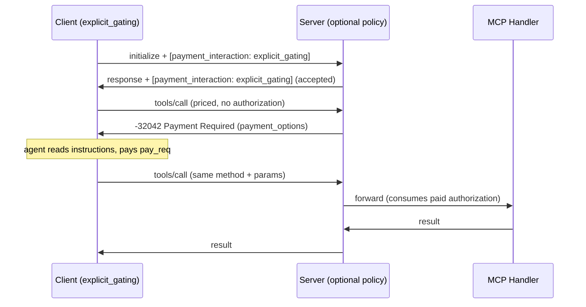

# Explicit payment gating

Explicit gating is the CEP-8 payment interaction mode where a priced invocation returns a **payment error** instead of being silently settled by middleware. Use it when payment decisions must be visible to the application or an LLM agent (budget control, interactive consent, "Code Mode" policies).

This is an opt-in **lifecycle** negotiated per session. The default lifecycle remains [transparent](/how-to/payments/getting-started) (notification-based, handled by middleware). See the [Explicit Gating API reference](/reference/ts-sdk/payments/explicit-gating) for the full type surface.

## How a session is gated



The capability result is produced **only** on the retry that consumes a paid authorization. The original invocation is never forwarded to the underlying MCP handler unpaid.

## 1) Server: keep the default policy

`withServerPayments` defaults to `paymentInteraction: 'optional'`, which already accepts `explicit_gating` requests — no extra configuration is required. Define your priced capabilities and a processor as usual.

```ts
import {
  LnBolt11NwcPaymentProcessor,
  withServerPayments,
} from "@contextvm/sdk/payments";
import type { PricedCapability } from "@contextvm/sdk/payments";

const pricedCapabilities: PricedCapability[] = [
  { method: "tools/call", name: "search", amount: 25, currencyUnit: "sats" },
];

const processor = new LnBolt11NwcPaymentProcessor({
  nwcConnectionString: process.env.NWC_SERVER_CONNECTION!,
});

withServerPayments(transport, {
  processors: [processor],
  pricedCapabilities,
});
```

See [Server payments](/how-to/payments/server) for the full policy options (`'optional'` vs `'transparent'`) and the 0.13.0 default change.

Dynamic pricing, rejection (`reject`), and waiver (`waive`) work identically in both lifecycles through the same `resolvePrice` callback. In explicit gating, a `reject` is returned as a `-32000` invocation error rather than a `notifications/payment_rejected`.

## 2) Client: request the lifecycle

Opt into the lifecycle by setting `paymentInteraction: "explicit_gating"`. No payment callback is required — a priced invocation returns a normal MCP error that the agent or application handles itself.

```ts
import {
  LnBolt11NwcPaymentHandler,
  withClientPayments,
} from "@contextvm/sdk/payments";

const handler = new LnBolt11NwcPaymentHandler({
  nwcConnectionString: process.env.NWC_CLIENT_CONNECTION!,
});

const paidTransport = withClientPayments(baseTransport, {
  handlers: [handler],
  paymentInteraction: "explicit_gating",
});
```

The wrapper advertises the requested mode and your PMIs on the Nostr transport. Once the server accepts it, every priced invocation surfaces a `-32042 Payment Required` error to the caller unchanged.

## 3) Agent loop: read the error, pay, retry

The `-32042` error carries everything the agent needs: `instructions` (a human/agent-readable string) and one or more `payment_options`. Feed the error to the agent, let it pay `pay_req` by its own means, and retry the call with the same `method` and `params`.

```ts
try {
  const result = await client.callTool({
    name: "search",
    arguments: { query: "contextvm" }, // deterministic args
  });
} catch (err) {
  if (isPaymentRequired(err)) {
    // err.response.error.data.instructions  → feed to the agent
    // err.response.error.data.payment_options[0]  → { amount, pmi, pay_req, ttl, ... }
    const option = err.response.error.data.payment_options[0];

    await payByWhateverMeans(option.pay_req); // agent's own wallet

    // Retry the exact same call. The server matches it to the paid
    // authorization by canonical invocation identity (method + params).
    return client.callTool({
      name: "search",
      arguments: { query: "contextvm" },
    });
  }
  throw err;
}
```

The agent never needs SDK-specific knowledge. The `instructions` field tells it exactly what to do (pay one option, then repeat the request with the same method and params), so this works with any MCP-compatible agent runtime.

While the server is still verifying payment, the retry returns `-32043 Payment Pending` with `data.retry_after`; wait and retry again. Once the paid authorization is consumed, the normal capability result is returned on the next matching invocation.

## 4) Retry semantics

A paid authorization authorizes **one** future execution for the matching client pubkey and canonical invocation identity (SHA-256 over JCS of `method` + `params`).

- Retry with the **same `method` and `params`** so the server matches the paid authorization. The JSON-RPC `id` and outer Nostr event id do **not** need to match.
- `-32043 Payment Pending` (`data.retry_after`) means verification is still in flight. The server suggests a short wait; honor it before retrying.
- If the server's verification fails or times out **after** the client paid, its pending state is cleared and the retry receives a **fresh** `-32042` with a new invoice. The agent must pay again.

:::warning[Params must be deterministic]
The canonical identity is computed from `method` + `params`. Do **not** inject timestamps, UUIDs, or random nonces into `params`. Preserve the exact original `params` object on retry so the server matches the paid authorization.
:::

## 5) Optional: auto-retry with `onPaymentRequired`

For non-agent clients that want the wrapper to intercept the `-32042` and retry automatically (for example, a UI app with a built-in wallet), provide an `onPaymentRequired` callback. When provided, the `-32042` is **not** forwarded to the caller unless the callback declines or throws.

```ts
const paidTransport = withClientPayments(baseTransport, {
  handlers: [handler],
  paymentInteraction: "explicit_gating",
  onPaymentRequired: async ({ options, instructions }) => {
    const approved = await askUserToApprove({
      amount: options[0].amount,
      instructions,
    });
    if (!approved) return { paid: false, reason: "user_cancelled" };
    await handler.pay(options[0].pay_req);
    return { paid: true };
  },
  maxPendingRetries: 10, // default; -32043 retries before giving up
});
```

Return contract:

| Return value               | Result                                                                                                                                                              |
| -------------------------- | ------------------------------------------------------------------------------------------------------------------------------------------------------------------- |
| `{ paid: true }`           | The wrapper re-sends the **exact original request** (`method` + `params`) so the server matches the paid authorization.                                             |
| `{ paid: false, reason? }` | The caller's promise rejects with a synthesized `-32042 Payment Required` (`data: { reason }`).                                                                     |
| promise **rejects**        | The caller's promise rejects with a synthesized `-32042` (`data: { reason: error.message, type: 'payment_handler_error' }`). The wrapper never silently falls back. |

## 6) Negotiation failures

If the server does not support or does not accept `explicit_gating`, it returns a JSON-RPC error on the first direct response:

```json
{
  "code": -32602,
  "message": "Unsupported payment_interaction",
  "data": { "requested": "explicit_gating", "supported": ["transparent"] }
  }
}
```

The wrapper's **effective-mode guard** ensures the client does not then auto-satisfy transparent `notifications/payment_required` messages in that session: a local `-32000` error is synthesized instead of paying. Decide per application whether to abort the session or fall back to the transparent lifecycle explicitly.

## Related

- [Explicit Gating API reference](/reference/ts-sdk/payments/explicit-gating)
- [Payments (CEP-8) overview](/reference/ts-sdk/payments/overview)
- [Client payments](/how-to/payments/client)
- [Server payments](/how-to/payments/server)
- [CEP-8: Capability Pricing and Payment Flow](/reference/ceps/cep-8)
