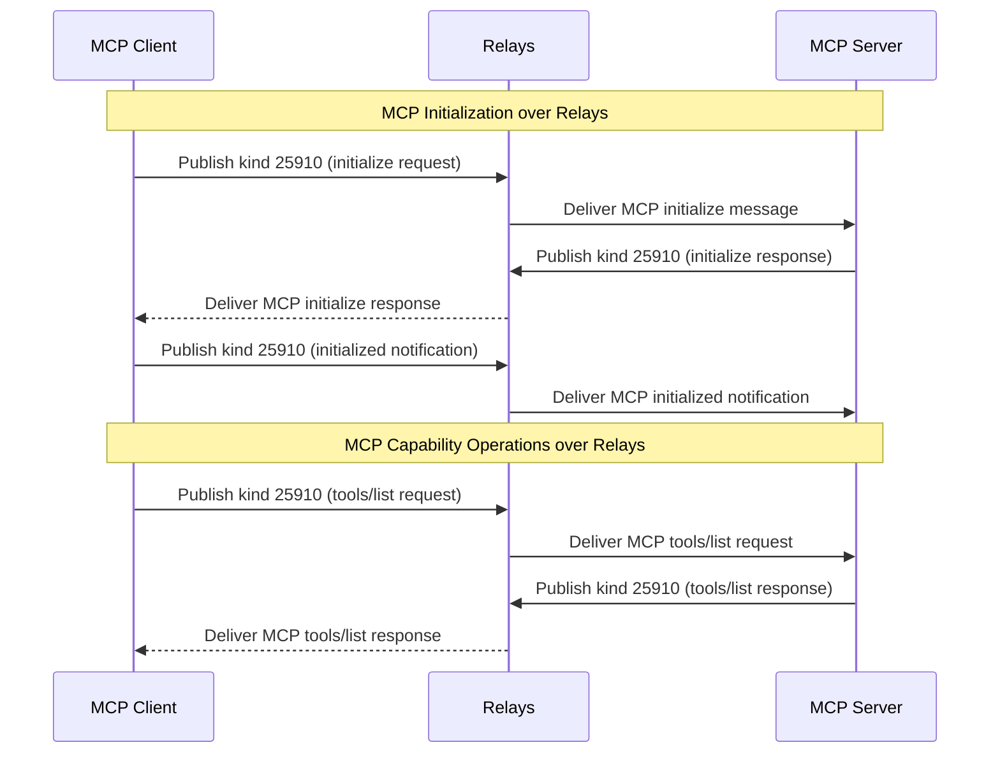

**Status:** Draft

## Abstract

The Context Vending Machine (ContextVM) specification defines how the Nostr protocol can be used as a transport layer for the Model Context Protocol (MCP), leveraging the Nostr relay network as the underlying communication mechanism. Also benefiting from Nostr's cryptographic primitives for verification, authorization, and additional features.

## Table of Contents

- [Introduction](#introduction)
  - [ContextVM as MCP Transport](#contextvm-as-mcp-transport)
  - [Public Key Cryptography](#public-key-cryptography)
- [Protocol Overview](#protocol-overview)
  - [Main Actors](#main-actors)
  - [Transport Layer Architecture](#transport-layer-architecture)
  - [Message Structure](#message-structure)
- [Event Kinds](#event-kinds)
- [Server Discovery](#server-discovery)
  - [Direct Discovery](#direct-discovery)
    - [Client Initialization Request](#client-initialization-request)
    - [Server Initialization Response](#server-initialization-response)
    - [Client Initialized Notification](#client-initialized-notification)
- [Capability Operations](#capability-operations)
  - [List Operations](#list-operations)
    - [List Request Template](#list-request-template)
    - [List Response Template](#list-response-template)
  - [Capability-Specific Item Examples](#capability-specific-item-examples)
    - [Call Tool Request](#call-tool-request)
    - [Call Tool Response](#call-tool-response)
- [Notifications](#notifications)
- [ContextVM Enhancement Proposals (CEPs)](#contextvm-enhancement-proposals-ceps)
- [Complete Protocol Flow](#complete-protocol-flow)

## Introduction

The [Model Context Protocol (MCP)](https://modelcontextprotocol.io/introduction) defines a standardized way for servers to expose capabilities and for clients to consume them. MCP is transport-agnostic, meaning it can operate over various communication channels. The Context Vending Machine (ContextVM) specification defines a Nostr-based transport layer for MCP, and some conventions on top for enabling secure, decentralized communication between MCP servers and clients.

### ContextVM as MCP Transport

ContextVM operates at the **transport layer** of MCP, providing a Nostr-based implementation that:

- **Transports MCP messages** through Nostr's relay network
- **Preserves JSON-RPC semantics** while leveraging Nostr's event structure
- **Adds cryptographic verification** and metadata capabilities to standard MCP communication
- **Enables decentralized service discovery** and communication without centralized infrastructure

This approach allows MCP servers and clients to communicate through Nostr while maintaining full compatibility with the MCP specification and gaining the benefits of Nostr's cryptographic security model.

### Public Key Cryptography

ContextVM leverages Nostr's public key cryptography to ensure message authenticity and integrity:

1. **Message Verification**: Every message is cryptographically signed by the sender's private key and can be verified using their public key, ensuring that:
   - Server announcements are legitimate
   - Client requests are from authorized users
   - Responses are from the expected servers

2. **Identity Management**: Public keys serve as persistent identifiers for all actors in the system:
   - Servers can maintain consistent identities across relays
   - Clients can be uniquely identified for authorization purposes

The cryptographic properties enable secure authorization flows for capability execution without requiring centralized authentication services.

## Protocol Overview

### Transport Layer Architecture

ContextVM operates as a transport layer for MCP, meaning it handles the communication channel while preserving the semantics of MCP messages. The architecture consists of:

1. **Transport Layer**: Nostr events and relays serve as the transport mechanism
2. **Message Layer**: JSON-RPC MCP messages are embedded within Nostr event content
3. **Metadata Layer**: Nostr event tags provide addressing and correlation information

This layered approach allows ContextVM to:

- Transport standard MCP messages without modification
- Add Nostr-specific addressing and verification
- Maintain compatibility with existing MCP implementations

### Message Structure

The protocol uses these key design principles for message handling:

1. **Content Field Structure**: The `content` field of Nostr events contains stringified MCP messages. All MCP message structures are preserved exactly as defined in the MCP specification, ensuring compatibility with standard MCP clients and servers.

2. **Nostr Metadata in Tags**: All Nostr-specific metadata uses event tags:
   - `p`: Public key for addressing servers or clients
   - `e`: Event ID references for correlating requests and responses

3. **Unified Event Kind**: ContextVM uses a single event kind for all communication:
   - `25910`: All ContextVM messages (ephemeral events)

   The event kind follows Nostr's conventions in [NIP-01](https://github.com/nostr-protocol/nips/blob/master/01.md#kinds):
   - For kind n such that 20000 <= n < 30000, events are ephemeral, which means they are not expected to be stored by relays for a long period, but rather just transmitted.

### Main Actors

There are three main actors in ContextVM architecture:

- **Servers**: MCP servers exposing capabilities, using a public key to sign messages
- **Relays**: Core component of the Nostr protocol that enables communication between clients and servers
- **Clients**: MCP or Nostr clients that discover and consume capabilities from servers, using a public key to sign messages

## Server Discovery

You can connect to MCP servers using ContextVM by knowing their public key and the relay(s) they are listening on. This process follows the standard MCP initialization specification, with ContextVM providing the transport mechanism by embedding JSON-RPC MCP messages in the `content` field of Nostr events.

**Note:** The content field of ContextVM events contains stringified MCP messages. The examples below present the content as a JSON object for readability; it must be stringified before inclusion in a Nostr event.

#### Client Initialization Request

```json
{
  "kind": 25910,
  "content": {
    "jsonrpc": "2.0",
    "id": 0,
    "method": "initialize",
    "params": {
      "protocolVersion": "2025-07-02",
      "capabilities": {
        "roots": {
          "listChanged": true
        },
        "sampling": {}
      },
      "clientInfo": {
        "name": "ExampleClient",
        "version": "1.0.0"
      }
    }
  },
  "tags": [["p", "<server-pubkey>"]]
}
```

- Tags:
  - `p`: Server public key

#### Server Initialization Response

```json
{
  "kind": 25910,
  "pubkey": "<server-pubkey>",
  "content": {
    "jsonrpc": "2.0",
    "id": 0,
    "result": {
      "protocolVersion": "2025-07-02",
      "capabilities": {
        "logging": {},
        "prompts": {
          "listChanged": true
        },
        "resources": {
          "subscribe": true,
          "listChanged": true
        },
        "tools": {
          "listChanged": true
        }
      },
      "serverInfo": {
        "name": "ExampleServer",
        "version": "1.0.0"
      },
      "instructions": "Optional instructions for the client"
    }
  },
  "tags": [["e", "<client-init-request-id>"]]
}
```

- Tags:
  - `e`: Reference to the client's initialization request event

#### Client Initialized Notification

After receiving the server initialization response, the client MUST send an initialized notification to indicate it is ready to begin normal operations:

```json
{
  "kind": 25910,
  "pubkey": "<client-pubkey>",
  "content": {
    "jsonrpc": "2.0",
    "method": "notifications/initialized"
  },
  "tags": [
    ["p", "<provider-pubkey>"] // Required: Target provider public key
  ]
}
```

This notification completes the initialization process and signals to the server that the client has processed the server's capabilities and is ready to begin normal operations.

**Note:** The initialization process is not required for ContextVM servers to operate as they can work in a stateless fashion. However, it is recommended to use it to ensure that the server is ready to accept requests from clients.

## Capability Operations

After initialization, clients can interact with server capabilities.

### List Operations

All list operations follow the same structure described by MCP, with the specific capability type indicated in the method name.

- Tags:
  - `p`: Provider public key

#### List Request Template

```json
{
  "kind": 25910,
  "pubkey": "<client-pubkey>",
  "id": "<request-event-id>",
  "content": {
    "jsonrpc": "2.0",
    "id": 1,
    "method": "<capability>/list", // tools/list, resources/list, or prompts/list
    "params": {
      "cursor": "optional-cursor-value"
    }
  },
  "tags": [
    ["p", "<provider-pubkey>"] // Required: Provider's public key
  ]
}
```

#### List Response Template

```json
{
  "kind": 25910,
  "pubkey": "<provider-pubkey>",
  "content": {
    "jsonrpc": "2.0",
    "id": 1,
    "result": {
      "<items>": [
        // "tools", "resources", or "prompts" based on capability
        // Capability-specific item objects
      ],
      "nextCursor": "next-page-cursor"
    }
  },
  "tags": [
    ["e", "<request-event-id>"] // Required: Reference to the request event
  ]
}
```

### Capability-Specific Item Examples

#### Call Tool Request

```json
{
  "kind": 25910,
  "id": "<request-event-id>",
  "pubkey": "<client-pubkey>",
  "content": {
    "jsonrpc": "2.0",
    "id": 2,
    "method": "tools/call",
    "params": {
      "name": "get_weather",
      "arguments": {
        "location": "New York"
      }
    }
  },
  "tags": [["p", "<provider-pubkey>"]]
}
```

#### Call Tool Response

```json
{
  "kind": 25910,
  "pubkey": "<provider-pubkey>",
  "content": {
    "jsonrpc": "2.0",
    "id": 2,
    "result": {
      "content": [
        {
          "type": "text",
          "text": "Current weather in New York:\nTemperature: 72°F\nConditions: Partly cloudy"
        }
      ],
      "isError": false
    }
  },
  "tags": [["e", "<request-event-id>"]]
}
```

For other capabilities (resources, prompts, completions, ping, etc.), the `content` field follows the same pattern as other MCP messages, containing a stringified JSON-RPC object that adheres to the MCP specification.

## Notifications

All notifications in ContextVM follow the standard MCP notification format and conventions, using the unified kind 25910 event type. This includes notifications for payment requests, progress updates, and all other server-to-client or client-to-server communications.

Notifications are constructed according to the standard MCP notification template.

## ContextVM Enhancement Proposals (CEPs)

The ContextVM protocol is subject to ongoing improvements and enhancements. These improvements are managed through the ContextVM Enhancement Proposal (CEP) process, which is described in detail in the [CEP Guidelines](https://docs.contextvm.org/spec/cep-guidelines/)

### Accepted CEPs

The following CEPs have been accepted:

### Final CEPs

The following CEPs have been finalized:

- [CEP-4: Encryption Support](/spec/ceps/cep-4)
- [CEP-6: Public Server Announcements](/spec/ceps/cep-6)

## Complete Protocol Flow


